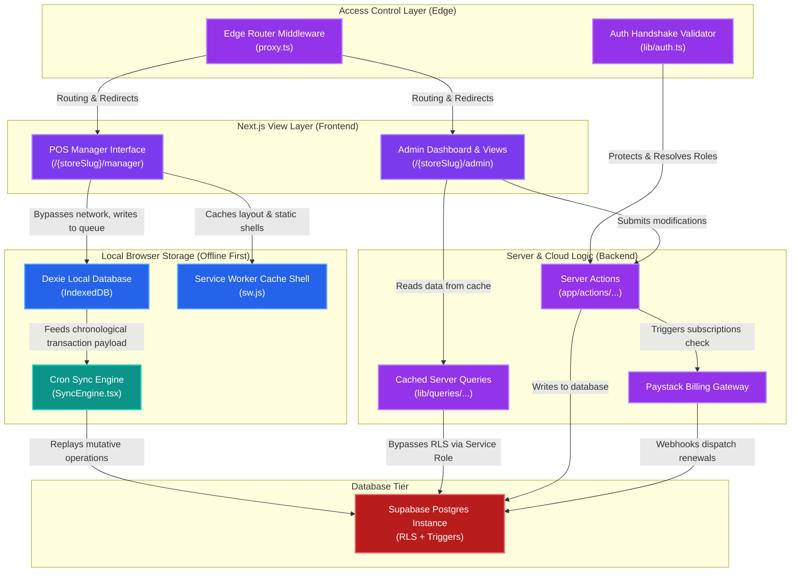
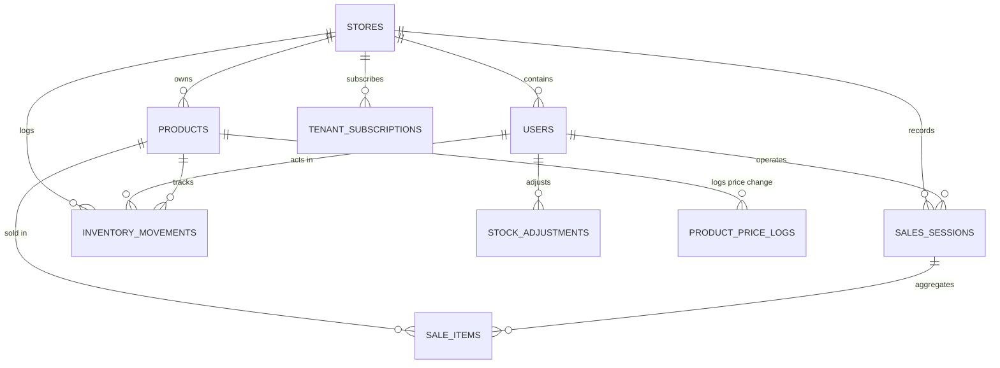

# ❄️ FrozenPOS (Cashbook) - Ultimate Technical Architecture & Reference Manual

FrozenPOS (commercially referred to as Cashbook) is a high-performance, multi-tenant SaaS Retail Point-of-Sale (POS) and inventory auditing management platform. Engineered with Next.js 16+, React 19, Tailwind CSS v4, and Supabase (PostgreSQL), FrozenPOS is built for maximum speed, security, and offline reliability. It features a robust client-side storage architecture (`IndexedDB` powered by `Dexie.js`), an automated chronological queue synchronization engine, deep database-level ledger automation, and complete platform governance utilities.

---

## 🏗️ 1. Architecture & Design Principles

FrozenPOS uses a hybrid client-server model optimized for edge deployments, real-time sync, and offline operability.



### Core Layers:
1. **Edge Router Layer ([proxy.ts](file:///c:/Users/HP/Documents/cashbook/proxy.ts))**: A Next.js Edge middleware interceptor that validates request credentials, checks store activation statuses, enforces role-based route matching, parses tenant subfolders, and handles support-agent cookie impersonation.
2. **Server View/Controller Layer (Next.js App Router)**: Multi-tenant, parameterized routes (e.g. `/[storeSlug]/admin/...` and `/[storeSlug]/manager/...`). Server components run initial auth handshakes and fetch cached database state to render screens quickly.
3. **Database Write Layer (Server Actions)**: Fully isolated Server Actions located in `app/actions/` perform write operations, billing tier checks, price change logs, and invalidation updates.
4. **Offline Persistence Layer (Dexie.js & IndexedDB)**: High-speed local database ([lib/db.ts](file:///c:/Users/HP/Documents/cashbook/lib/db.ts)) that captures manager sales sessions, item transactions, and stock changes to allow uninterrupted checkout during network drops.
5. **Headless Synchronization Layer ([components/SyncEngine.tsx](file:///c:/Users/HP/Documents/cashbook/components/SyncEngine.tsx))**: An automated background engine that replays transactions chronologically to the cloud, recovers from page crashes or unmount states, auto-reconstructs orphaned sessions, and resolves unique constraints silently.
6. **Platform Database Layer (Supabase PostgreSQL)**: Cloud database that enforces strict multi-tenant Row Level Security (RLS) and runs atomic triggers to maintain inventory ledgers and stock counts.

---

## 🎛️ 2. Role-Based Access Control (RBAC) & Routes

Authentication and authorization are verified at both the routing level (Edge middleware) and execution level (Server Actions) using [lib/auth.ts](file:///c:/Users/HP/Documents/cashbook/lib/auth.ts) and [proxy.ts](file:///c:/Users/HP/Documents/cashbook/proxy.ts).

### Role Matrix

| Capability / Resource | Super Admin (`super_admin`) | Store Owner / Admin (`admin`) | POS Clerk / Manager (`manager`) |
| :--- | :---: | :---: | :---: |
| Access Public Landing Sites | Yes | Yes | Yes |
| Run POS Checkout & Sales Sessions | Yes (via Impersonation) | Yes | Yes |
| View Manager Session History | Yes (via Impersonation) | Yes | Yes (Self Only) |
| Create, Edit, & Archive Products | Yes (via Impersonation) | Yes | No |
| Adjust Stock (Damage/Restock) | Yes (via Impersonation) | Yes | No |
| Manage Staff Accounts | Yes (via Impersonation) | Yes | No |
| Approve Daily Checkout Shits | Yes (via Impersonation) | Yes | No |
| Access Store Financial Ledger | Yes (via Impersonation) | Yes | No |
| Manage Subscription & Billing | Yes (via Impersonation) | Yes | No |
| Impersonate Tenant Store Slugs | Yes | No | No |
| Deactivate/Exempt Stores or Users | Yes | No | No |
| Wipe Store Data (GDPR compliance) | Yes | No | No |
| Hard Export Store Database | Yes | No | No |
| Publish System Broadcast Banners | Yes | No | No |

### Security Implementations
- **Resilient Handshakes**: [lib/auth.ts](file:///c:/Users/HP/Documents/cashbook/lib/auth.ts) catches network glitches (e.g. DNS stutter, connection resets, PG timeout errors) and retries the authentication check to prevent unexpected app crashes.
- **Service Role Restriction**: Admin privileges are managed securely via `supabase-admin.ts` on the server and are never loaded in the browser context.
- **Dual-Layer Guard**: Every Server Action performs a role check using `requireRole()` as the very first line of code, while [proxy.ts](file:///c:/Users/HP/Documents/cashbook/proxy.ts) redirects unauthorized routing attempts.

---

## 📁 3. Directory Layout & Development Zone Boundaries

To prevent version control conflicts and divide work cleanly between developers, the codebase is structured into strict frontend-owned and backend-owned folders (governed by [ARCHITECTURE.md](file:///c:/Users/HP/Documents/cashbook/ARCHITECTURE.md)).

```
cashbook/
├── app/
│   ├── (auth)/                    ← Login, Registration, Password Reset screens
│   ├── api/webhooks/paystack/     ← Webhook endpoint verifying charge successes
│   ├── actions/                   ← BACKEND OWNED: Database Server Actions (Mutations)
│   │   ├── auth.ts                ← Register, login, and sign-out logic
│   │   ├── billing.ts             ← Subscription checkout setup & verification
│   │   ├── products.ts            ← Add, edit, archive products & restock additions
│   │   ├── sales.ts               ← Modify, delete individual sale items, approve sessions
│   │   ├── staff.ts               ← Manage manager accounts via Auth Admin APIs
│   │   └── super-admin.ts         ← Impersonation, broadcasts, deactivation actions
│   │
│   └── [storeSlug]/               ← VIEW/CONTROLLER: Multi-tenant page layouts
│       ├── admin/                 ← Owner UI (Dashboard, products, staff, billing, ledger)
│       └── manager/               ← Operator UI (POS interface, history, corrections)
│
├── components/                    ← FRONTEND OWNED: Modular UI components & styling
│   ├── admin/                     ← Admin lists, ledger tables, billing panels
│   ├── manager/                   ← POS cash registers, session history widgets
│   ├── shared/                    ← Reusable modals, custom badges, global alerts
│   ├── ui/                        ← Atomic components (buttons, dropdowns, inputs)
│   └── SyncEngine.tsx             ← Headless database synchronizer component
│
├── hooks/                         ← FRONTEND OWNED: Reusable React state hooks
├── lib/                           ← BACKEND OWNED: Core logic, queries & service utilities
│   ├── queries/                   ← Backend read-only database queries (Cached)
│   │   ├── dashboard.ts           ← Analytics pipelines for dashboards
│   │   ├── products.ts            ← Product lookups and quantity metrics
│   │   ├── sales.ts               ← Sales reports, manager history daily groupings
│   │   └── store.ts               ← Ledger, billing details, store metadata
│   │
│   ├── types/                     ← SHARED: TypeScript declarations (Single Source of Truth)
│   │   └── index.ts               ← Shared data interfaces and type definitions
│   │
│   ├── auth.ts                    ← User authentication & retry-resilience checks
│   ├── db.ts                      ← Dexie local DB configuration
│   ├── planEnforcement.ts         ← Subscription checks & limit enforcements
│   └── plans.ts                   ← Plan pricing & tier limitation definitions
│
├── public/                        ← Static assets, local fonts, and PWA shell manifest
│   └── sw.js                      ← PWA Service Worker caching and network interceptor
└── scripts/                       ← Administrative CLI tools and database utilities
```

### Team Coding Rules:
1. **Types Policy**: All schemas and types must be declared in [lib/types/index.ts](file:///c:/Users/HP/Documents/cashbook/lib/types/index.ts). Entity types must never be defined inline.
2. **Read Queries**: Page views must read data through functions in `lib/queries/` and must never make direct Supabase client queries.
3. **Write Mutations**: Browser code must modify data through Next.js Server Actions and is prohibited from initiating direct DB writes.
4. **Resilience Layer**: All network fetch retries are configured inside read queries using retry loops.

---

## 💾 4. Database Schema & Ledger Design

The system database isolates stores by tenant IDs while keeping records consistent during modifications.



### Core Entities:
- **`stores`**: Tenant definitions storing names, slugs, plan tiers (`free`, `basic`, `premium`), active status, and billing exemptions.
- **`users`**: Store employees and managers. Tracks activation status, roles (`super_admin`, `admin`, `manager`), and associated `store_id`.
- **`products`**: Store stock items. Tracks names, units (e.g. Pack, Bottle), quantities, `min_quantity` (for low-stock alerts), and cost/selling prices.
- **`sales_sessions`**: Operator work shifts. Sessions must be manually opened by managers and closed/approved by administrators.
- **`sale_items`**: Individual sales line records containing quantity, selling price, unit cost, and subtotals.
- **`inventory_movements`**: The auditing ledger logging all product stock changes with before/after counts, action reference IDs, and the user who made the change.
- **`tenant_subscriptions`**: Paystack payment records tracking current subscription periods, statuses (`active`, `expired`), and reference IDs.
- **`product_price_logs`**: Historical price audits tracking cost/selling changes made by admins.
- **`system_broadcasts`**: Global banners posted by super-admins that display across all active store panels.

---

## ⚡ 5. Database Triggers & Automations

PostgreSQL triggers automate stock changes and maintain ledger integrity, keeping database writes secure and atomic.

### Triggers:
1. **`trg_master_sale_sync` (on `sale_items`)**:
   - **`INSERT`**: Automatically decrements the product's quantity by the sold amount and creates an `inventory_movements` log (reference points to the session ID).
   - **`UPDATE`**: Computes the difference between old and new quantities, updates the product's stock count, and creates a ledger movement logging the change.
   - **`DELETE` / Soft-Delete**: Detects when a sale item is flagged as deleted or removed, restores the stock to the product's inventory, and logs a recovery movement.
2. **`trg_audit_restock_movement` (on `stock_additions`)**:
   - Fires when stock is added. Automatically updates the product's stock level and records a `RESTOCK` log in `inventory_movements` showing the adjustment.
3. **`trg_audit_adjustment_movement` (on `stock_adjustments`)**:
   - Tracks manual adjustments for stock damage, theft, or inventory counts. Automatically calculates the change, updates the product's quantity, and creates a ledger record.

> [!IMPORTANT]
> The database triggers are the single source of truth for stock levels. Server Actions must never make manual application-level stock adjustments during sales or restocks, as doing so will double-deduct inventory.

---

## 🛜 6. Offline Resiliency & Sync Engine

FrozenPOS's operator POS interface operates fully offline, allowing managers to process sales during internet blackouts.

### Service Worker Caching ([public/sw.js](file:///c:/Users/HP/Documents/cashbook/public/sw.js))
- **Shell Caching**: Caches static assets, routes, local fonts, and styling files during registration.
- **Navigate Strategy (HTML)**: **Network-First with Cache Fallback**. Fetches live pages when online, and falls back to cached copies when offline to prevent blank screens.
- **Asset Strategy (JS, CSS, Media)**: **Stale-While-Revalidate**. Serves files from cache immediately to maximize load speeds, while updating them in the background.
- **Dev-Mode Bypass**: Automatically detects local hot-reloads and clears cache intercepts to ensure a seamless development experience.

### Client Database Queue ([lib/db.ts](file:///c:/Users/HP/Documents/cashbook/lib/db.ts))
Uses `Dexie.js` to manage an `offlineQueue` table, storing pending operations in order:
```typescript
export interface OfflineQueueItem {
  id?: number;
  store_id: string;
  type: 'sale_session' | 'sale_item' | 'stock_decrement' | 'sale_item_delete' | 'sale_session_delete';
  payload: any;
  created_at: number;
  status: 'pending' | 'syncing' | 'failed' | 'fatal';
}
```

### Sync Engine Replay Workflow ([components/SyncEngine.tsx](file:///c:/Users/HP/Documents/cashbook/components/SyncEngine.tsx))
1. **Network Restore Listener**: Detects when connection is restored and fires `processQueue()`.
2. **Glitch Recovery**: Scans and resets any items stuck in a `syncing` or `failed` state due to a page reload or sudden connection drop.
3. **Chronological Replay**: Groups queue items by creation time and replays them to Supabase:
   - **Sales Sessions**: Upserts sessions using conflict bypass rules.
   - **Sale Items**: Upserts sale records using the local UUID.
4. **Parent Re-construction**: If a sale item's parent session is missing on the server, the engine automatically creates a temporary parent session to satisfy database foreign keys.
5. **Conflict Resolution**: Identifies fatal errors (e.g. product deleted, closed session approved) and labels those queue items as `fatal` to bypass loops and prevent queue blockage.

---

## 💳 7. Subscription Plans & Paystack Billing

Access levels, capacity caps, and subscription renewals are managed dynamically via Paystack billing integration.

### Subscription Tier Comparison

| Feature / Limit | Free | Starter | Growth | Business / Enterprise |
| :--- | :---: | :---: | :---: | :---: |
| Monthly Fee | ₦0 | ₦7,500 | ₦15,000 | ₦35,000 |
| Annual Fee | ₦0 | ₦75,000 | ₦150,000 | ₦350,000 |
| Maximum Products | 1,000,000 | 1,000,000 | 1,000,000 | 1,000,000 |
| Maximum Staff Accounts | 2 | 2 | 5 | Unlimited |
| Maximum Tenant Stores | 1 | 1 | 1 | 3 |
| Searchable History | 90 days | 90 days | 180 days | Unlimited |
| Export Excel Reports | No | No | Yes | Yes |
| Multi-Store Dashboard | No | No | No | Yes |
| Financial Audit Logs | No | Yes | Yes | Yes |

### Billing Implementations
- **Checkout Initialization ([app/actions/billing.ts](file:///c:/Users/HP/Documents/cashbook/app/actions/billing.ts))**: Calculates billing values based on plan type and term cycle, then initializes a transaction on Paystack, returning a redirect URL.
- **Renewal Webhook ([app/api/webhooks/paystack/route.ts](file:///c:/Users/HP/Documents/cashbook/app/api/webhooks/paystack/route.ts))**:
  - Verifies signature headers via HMAC SHA512.
  - Updates matching store tiers (`basic` / `premium`) on `charge.success` events.
  - Generates or updates subscription records in the `tenant_subscriptions` table.
  - Gracefully handles automatic renewals by resolving store IDs from subscription IDs.
- **Enforcement Rules ([lib/planEnforcement.ts](file:///c:/Users/HP/Documents/cashbook/lib/planEnforcement.ts))**:
  - Enforces product creation, staff creation, and store count limits at the Server Action level.
  - Blocks modifications if a paid subscription has expired.
  - Automatically provides a 14-day Growth-feature trial to new store sign-ups.

---

## 🛠️ 8. Impersonation & Platform Management

Super Admins can access administrative utilities in `app/actions/super-admin.ts` to manage the platform:

1. **Customer Support Impersonation ([app/actions/impersonation.ts](file:///c:/Users/HP/Documents/cashbook/app/actions/impersonation.ts))**:
   - Super Admins can set an `impersonate_store_id` cookie to view store dashboards exactly as the tenant does, without requiring tenant credentials.
   - [lib/auth.ts](file:///c:/Users/HP/Documents/cashbook/lib/auth.ts) resolves the user's active `storeId` to the impersonated ID during page renders.
2. **System Broadcast Banner ([app/actions/broadcasts.ts](file:///c:/Users/HP/Documents/cashbook/app/actions/broadcasts.ts))**:
   - Allows publishing and toggling active banners in the `system_broadcasts` table, displaying alerts across all tenant dashboards.
3. **Data Compliance Exports ([app/actions/tenant-data.ts](file:///c:/Users/HP/Documents/cashbook/app/actions/tenant-data.ts))**:
   - Supports export functions that bundle store metrics into JSON strings for user backups.
   - Wipe features securely hard-delete stores, users, sessions, and products to ensure GDPR compliance.

---

## ⚙️ 9. Environment Configuration Variables

The application requires the following environment variables to run. Create a file named `\.env.local` in the project root:

```ini
# Supabase Configuration (Required for both client and server connection)
NEXT_PUBLIC_SUPABASE_URL=https://<your-project-ref>.supabase.co
NEXT_PUBLIC_SUPABASE_ANON_KEY=<your-anon-key>
SUPABASE_SERVICE_ROLE_KEY=<your-service-role-key>

# Paystack API Keys
NEXT_PUBLIC_PAYSTACK_PUBLIC_KEY=pk_test_...
PAYSTACK_SECRET_KEY=sk_test_...
PAYSTACK_WEBHOOK_SECRET=sk_test_...

# Tenant Support Direct Links
NEXT_PUBLIC_CONTACT_WHATSAPP=https://wa.me/234...

# Paystack Plan Identifiers (Monthly Tiers)
NEXT_PUBLIC_PAYSTACK_PLAN_STARTER_MONTHLY=PLN_...
NEXT_PUBLIC_PAYSTACK_PLAN_GROWTH_MONTHLY=PLN_...
NEXT_PUBLIC_PAYSTACK_PLAN_BUSINESS_MONTHLY=PLN_...

# Paystack Plan Identifiers (Annual Tiers)
NEXT_PUBLIC_PAYSTACK_PLAN_STARTER_MONTHLY_ANNUAL=PLN_...
NEXT_PUBLIC_PAYSTACK_PLAN_GROWTH_MONTHLY_ANNUAL=PLN_...
NEXT_PUBLIC_PAYSTACK_PLAN_BUSINESS_MONTHLY_ANNUAL=PLN_...

# Next.js Application URL
NEXT_PUBLIC_APP_URL=http://localhost:3000
```

---

## 🚀 10. Local Development & Setup

### Requirements:
- **Node.js**: `v20.x` or `v22.x`
- **Package Manager**: `npm`

### Installation & Launch:
1. Clone the repository and navigate to the project directory:
   ```bash
   cd cashbook
   ```
2. Install the project dependencies:
   ```bash
   npm install
   ```
3. Start the Next.js development server:
   ```bash
   npm run dev
   ```
4. Build the production build:
   ```bash
   npm run build
   ```
5. Run the linter:
   ```bash
   npm run lint
   ```

### Running Utility Scripts:
Administrative scripts are available in the `scripts/` folder:
- **Analyze database time synchronizations**:
  ```bash
  node scripts/db_time.js
  ```
- **Inspect active sales session triggers**:
  ```bash
  node scripts/inspect_session_triggers.js
  ```
- **List store accounts and users**:
  ```bash
  node scripts/list_store_users.js
  ```
